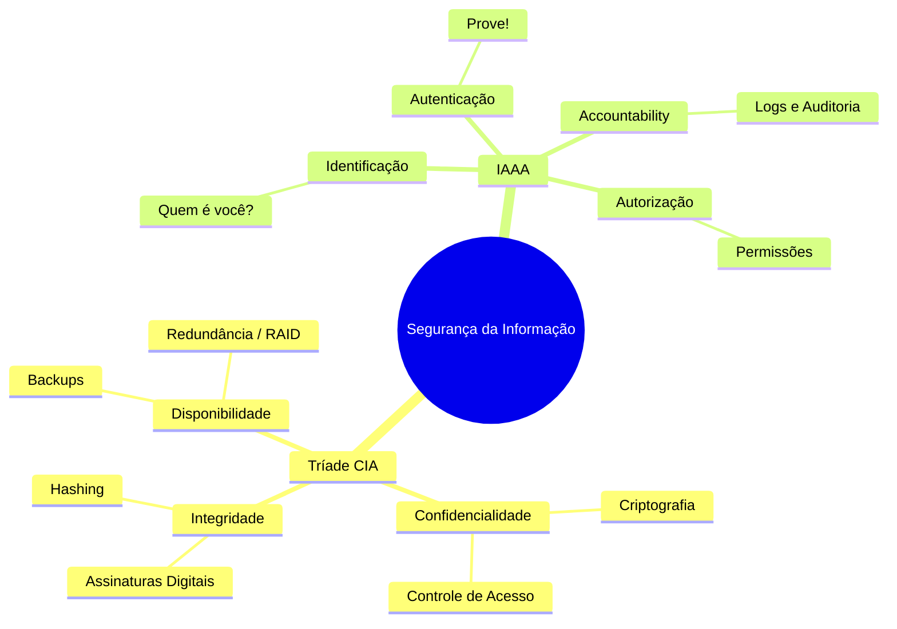
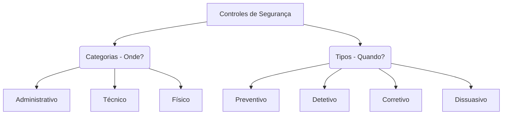
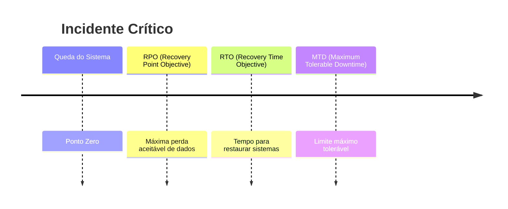
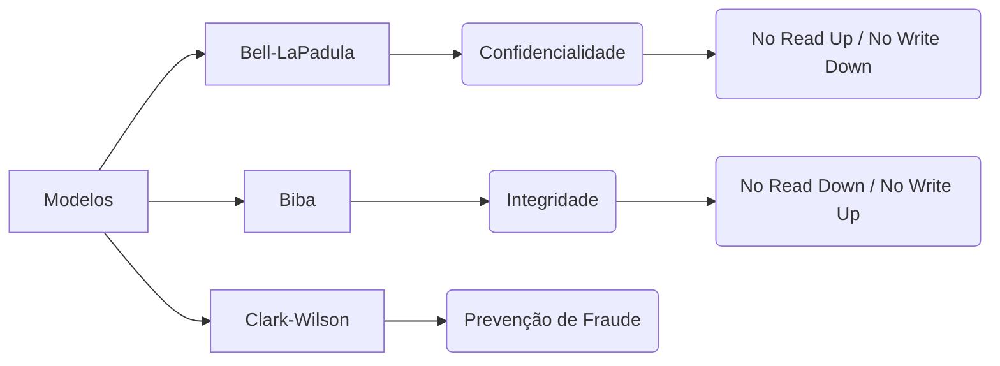
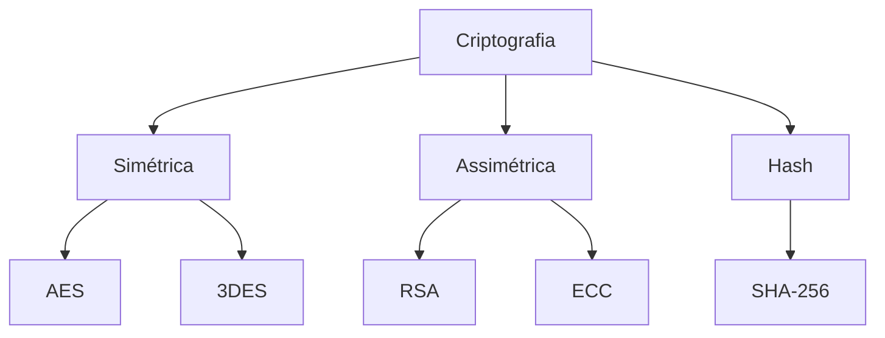

# 🛡️ (ISC)² Certified in Cybersecurity (CC) - Blue Team Master Guide [PT-BR]

Bem-vindo ao Guia Definitivo de Preparação para a certificação (ISC)² CC. Este repositório foi arquitetado para operações de **Blue Team** e Defesa Cibernética, dissecando os fundamentos desde a governança de risco até a arquitetura de redes.

---

## 🧠 Mapa Mental Central: A Base da Segurança



---

# 🏛️ DOMÍNIO 1: Princípios de Segurança e Governança

## Governança e Ética

A (ISC)² exige um entendimento rigoroso sobre deveres e ética profissional.

| Conceito | Definição Prática no SOC | Exemplo |
|---|---|---|
| Due Diligence | Dever de investigar | Pentest antes de contratar fornecedor |
| Due Care | Dever de manter segurança | Aplicar patches semanalmente |
| Os 4 Cânones | Código de ética ISC² | Proteger sociedade > agir legalmente |
| PII | Informação pessoal identificável | CPF, biometria |

---

## Matriz de Controles de Segurança

🚨 **Pegadinha de prova:** Categoria ≠ Tipo



---

## 📊 Matemática do Risco (Risk Quantification)

Na gestão de risco em segurança da informação, utilizamos cálculos quantitativos para estimar o impacto financeiro de incidentes de segurança.

### 🧮 Fórmula Principal

```
ALE = SLE × ARO
```

### 📚 Definições

| Sigla | Nome | Significado |
|------|------|-------------|
| **EF** | Exposure Factor | Percentual de perda quando o incidente ocorre |
| **SLE** | Single Loss Expectancy | Prejuízo causado por um único incidente |
| **ARO** | Annual Rate of Occurrence | Frequência anual do incidente |
| **ALE** | Annual Loss Expectancy | Perda financeira anual esperada |

---

### 🔢 Etapas do Cálculo

#### 1️⃣ Calcular o SLE

```
SLE = Asset Value × EF
```

#### 2️⃣ Calcular o ALE

```
ALE = SLE × ARO
```

---

### 💻 Exemplo Prático

| Parâmetro | Valor |
|----------|------|
| Asset Value | $100.000 |
| Exposure Factor | 25% |
| ARO | 2 vezes por ano |

#### Passo 1 — Calcular o SLE

```
SLE = 100.000 × 0.25
SLE = 25.000
```

#### Passo 2 — Calcular o ALE

```
ALE = 25.000 × 2
ALE = 50.000
```

---

### 📉 Resultado

> A organização pode perder **$50.000 por ano** devido a esse risco.

---

### 🛡️ Uso no Mundo Real

Se uma solução custa **$20.000** e elimina esse risco:

```
Custo da solução < ALE
```

Logo, o investimento **é justificável financeiramente**.

---

# 🚨 DOMÍNIO 2: Continuidade e Resposta a Incidentes

## Fluxo Organizacional

| Sigla | Nome | Escopo |
|---|---|---|
| BCP | Business Continuity Plan | Negócio |
| BIA | Business Impact Analysis | Impacto |
| DRP | Disaster Recovery Plan | TI |

---

## Linha do Tempo de Incidente



---

## 🚨 Fases de Resposta a Incidentes (NIST)

| Fase | Descrição |
|-----|-----------|
| **1. Preparação** | Criação de políticas, playbooks e ferramentas |
| **2. Detecção e Análise** | Identificação do incidente |
| **3. Contenção** | Isolar o sistema afetado |
| **4. Erradicação** | Remover malware e vulnerabilidades |
| **5. Recuperação** | Restaurar sistemas |
| **6. Lições Aprendidas** | Melhorar processos |

⚠ **Regra de ouro:** Contenção é a ação mais urgente.

---

# 🔑 DOMÍNIO 3: Controle de Acessos

## Gestão de Privilégios

- Least Privilege
- Need to Know
- Separation of Duties
- Privilege Creep

Mitigação:

✔ auditorias de acesso

---

## Biometria

| Métrica | Significado |
|---|---|
| FRR | Falsa rejeição |
| FAR | Falsa aceitação |

💡 CER mede precisão do sistema.

---

## Modelos de Segurança



---

## 🔐 Modelos de Controle de Acesso

| Modelo | Descrição |
|------|-----------|
| **DAC** | Dono do recurso define permissões |
| **MAC** | Sistema baseado em rótulos de segurança |
| **RBAC** | Baseado em cargos |
| **RuBAC** | Baseado em regras globais |

---

# 🌐 DOMÍNIO 4: Segurança de Redes

## Modelos de Cloud

| Modelo | Provedor | Cliente |
|---|---|---|
| IaaS | Infraestrutura | SO e Apps |
| PaaS | Infra + SO | Código |
| SaaS | Tudo | Uso |

---

## WAF vs IPS

IPS → Camadas 3 e 4  
WAF → Camada 7

Protege contra:

- SQL Injection
- XSS

---

## Vulnerabilidades

### VLAN Hopping

Mitigação:

- desativar DTP

### Split Tunneling

Cria ponte entre:

internet local + rede corporativa

✔ Melhor prática: **Full Tunneling**

---

## Portas Importantes

| Porta | Protocolo | Uso |
|---|---|---|
| 21 | FTP |
| 22 | SSH |
| 23 | Telnet |
| 25 | SMTP |
| 53 | DNS |
| 80 | HTTP |
| 443 | HTTPS |
| 1433 | SQL Server |
| 3389 | RDP |

---

# ⚙️ DOMÍNIO 5: Operações de Segurança

## Criptografia



---

## 💡 Dica de Prova

Dispositivos **IoT → ECC**

```
ECC (Elliptic Curve Cryptography)
```

Chaves menores → mesmo nível de segurança → menos processamento.

---

## ⚙️ Baseline vs Hardening

| Conceito | Definição |
|--------|-----------|
| **Baseline** | Padrão documentado |
| **Hardening** | Aplicação de configurações seguras |

### Exemplos

```
- Fechar portas
- Remover serviços
- Atualizar patches
```

---

## 🗑️ Destruição de Dados

| Método | Descrição |
|------|-----------|
| Clearing | Sobrescrever dados |
| Purging | Limpeza profunda |
| Degaussing | Campo magnético |
| Physical Destruction | Destruição física |

🔥 **Padrão ouro:** `Physical Destruction`

---

**Ícaro de Souza Mariano - ZeldrisMercy**