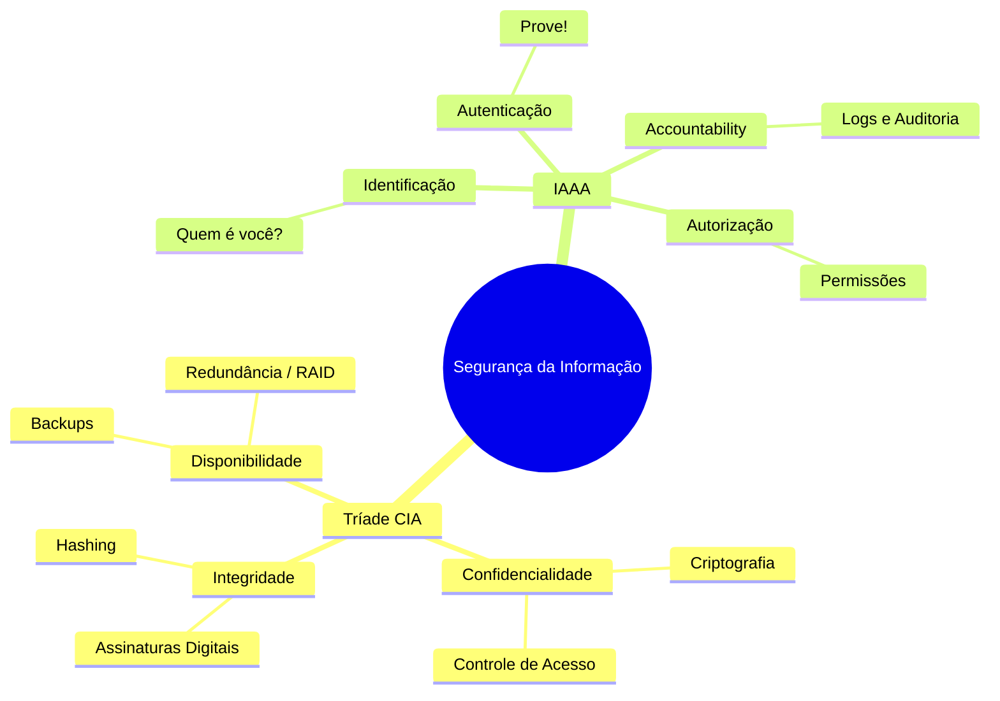
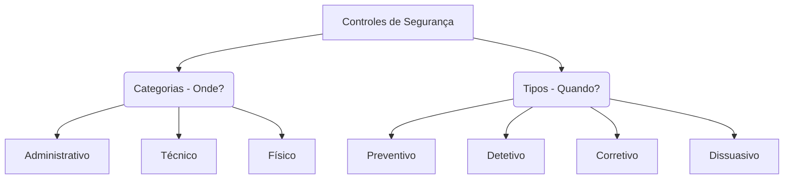
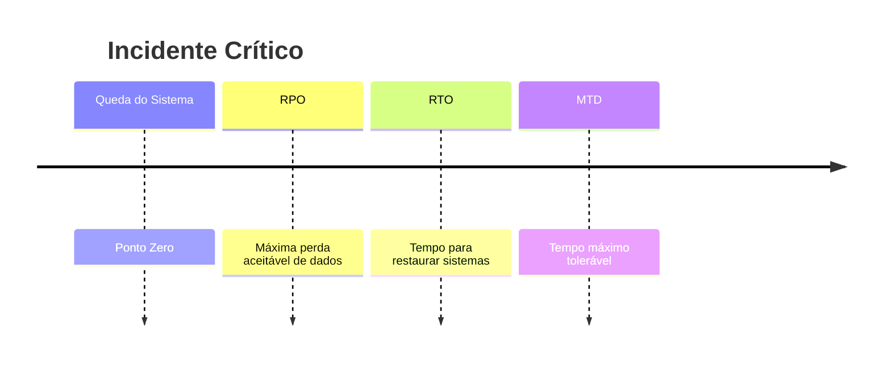
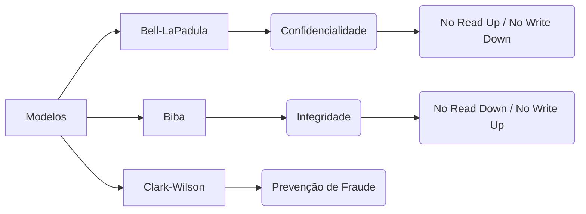
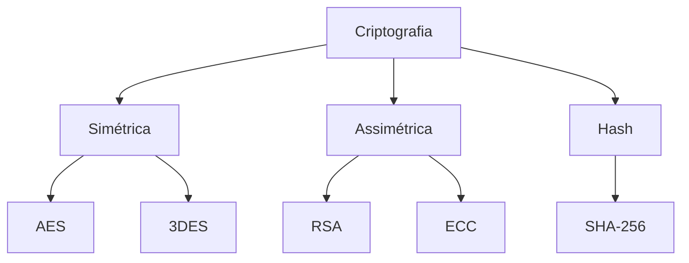

# 🛡️ (ISC)² Certified in Cybersecurity (CC) - Blue Team Master Guide [PT-BR]

Bem-vindo ao **Guia Definitivo de Preparação para a certificação (ISC)² CC**.

Este repositório foi arquitetado para operações de **Blue Team** e **Defesa Cibernética**, dissecando os fundamentos desde governança de risco até arquitetura de redes.

---

# 🧠 Mapa Mental Central: A Base da Segurança



---

# 🏛️ DOMÍNIO 1 — Princípios de Segurança e Governança

## Governança e Ética

A (ISC)² exige entendimento rigoroso de responsabilidade e ética profissional.

| Conceito | Definição Prática no SOC | Exemplo |
|---|---|---|
| Due Diligence | Dever de investigar | Pentest antes de contratar fornecedor |
| Due Care | Dever de manter segurança | Aplicar patches semanalmente |
| Os 4 Cânones | Código de ética ISC² | Proteger sociedade > agir legalmente |
| PII | Informação pessoal identificável | CPF, biometria |

---

## Matriz de Controles de Segurança

🚨 **Pegadinha de prova:** Categoria ≠ Tipo



---

## 📊 Matemática do Risco (Risk Quantification)

### 🧮 Fórmula Principal

```
ALE = SLE × ARO
```

### 📚 Definições

| Sigla | Nome | Significado |
|------|------|-------------|
| EF | Exposure Factor | Percentual de perda quando o incidente ocorre |
| SLE | Single Loss Expectancy | Prejuízo de um incidente |
| ARO | Annual Rate of Occurrence | Frequência anual |
| ALE | Annual Loss Expectancy | Perda anual esperada |

---

### 🔢 Etapas do cálculo

#### 1️⃣ Calcular SLE

```
SLE = Asset Value × EF
```

#### 2️⃣ Calcular ALE

```
ALE = SLE × ARO
```

---

### 💻 Exemplo

| Parâmetro | Valor |
|----------|------|
| Asset Value | $100.000 |
| Exposure Factor | 25% |
| ARO | 2 |

#### Cálculo

```
SLE = 100000 × 0.25
SLE = 25000
```

```
ALE = 25000 × 2
ALE = 50000
```

📉 **Resultado:** perda anual estimada de **$50.000**.

---

# 🚨 DOMÍNIO 2 — Continuidade e Resposta a Incidentes

## Fluxo Organizacional

| Sigla | Nome | Escopo |
|---|---|---|
| BCP | Business Continuity Plan | Negócio |
| BIA | Business Impact Analysis | Impacto |
| DRP | Disaster Recovery Plan | TI |

---

## Linha do Tempo de Incidente



---

## Fases de Resposta a Incidentes (NIST)

| Fase | Descrição |
|-----|-----------|
| Preparação | Políticas, playbooks, ferramentas |
| Detecção | Identificação do incidente |
| Contenção | Isolar sistema afetado |
| Erradicação | Remover malware |
| Recuperação | Restaurar sistemas |
| Lições Aprendidas | Melhorar processos |

⚠ **Regra de ouro:** contenção imediata.

---

# 🔑 DOMÍNIO 3 — Controle de Acessos

## Gestão de Privilégios

- Least Privilege
- Need to Know
- Separation of Duties
- Privilege Creep

Mitigação:

```
Auditorias de acesso
```

---

## Biometria

| Métrica | Significado |
|---|---|
| FRR | Falsa rejeição |
| FAR | Falsa aceitação |

💡 CER mede precisão do sistema.

---

## Modelos de Segurança



---

## Modelos de Controle de Acesso

| Modelo | Descrição |
|------|-----------|
| DAC | Dono define permissões |
| MAC | Baseado em rótulos |
| RBAC | Baseado em cargos |
| RuBAC | Baseado em regras |

---

# 🌐 DOMÍNIO 4 — Segurança de Redes

## Modelos de Cloud

| Modelo | Provedor | Cliente |
|---|---|---|
| IaaS | Infraestrutura | SO + Apps |
| PaaS | Infra + SO | Código |
| SaaS | Tudo | Uso |

---

## WAF vs IPS

```
IPS → Camadas 3 e 4
WAF → Camada 7
```

Protege contra:

- SQL Injection
- XSS

---

## Vulnerabilidades

### VLAN Hopping

Mitigação

```
Desativar DTP
```

### Split Tunneling

Cria ponte entre:

```
Internet local + rede corporativa
```

✔ Melhor prática: **Full Tunneling**

---

## Portas Importantes

| Porta | Protocolo | Uso |
|---|---|---|
| 21 | FTP | Transferência |
| 22 | SSH | Acesso remoto |
| 23 | Telnet | Obsoleto |
| 25 | SMTP | Email |
| 53 | DNS | Resolução |
| 80 | HTTP | Web |
| 443 | HTTPS | Web segura |
| 1433 | SQL Server | Banco |
| 3389 | RDP | Windows remoto |

---

# ⚙️ DOMÍNIO 5 — Operações de Segurança

## Criptografia



---

## 💡 Dica de prova

```
Dispositivos IoT → ECC
```

ECC usa **chaves menores com mesma segurança**, ideal para dispositivos com pouca capacidade.

---

## Baseline vs Hardening

| Conceito | Definição |
|--------|-----------|
| Baseline | Configuração padrão documentada |
| Hardening | Aplicar configurações seguras |

### Exemplos

```
Fechar portas
Remover serviços
Atualizar patches
```

---

## Destruição de Dados

| Método | Descrição |
|------|-----------|
| Clearing | Sobrescrever |
| Purging | Limpeza profunda |
| Degaussing | Campo magnético |
| Physical Destruction | Destruição física |

🔥 **Padrão ouro**

```
Physical Destruction
```

---

## 👨‍💻 Autor

**Ícaro de Souza Mariano - ZeldrisMercy**  
Threat Detection • SIEM • Blue Team • Incident Response

[](https://www.linkedin.com/in/icaro-s-m/)
---