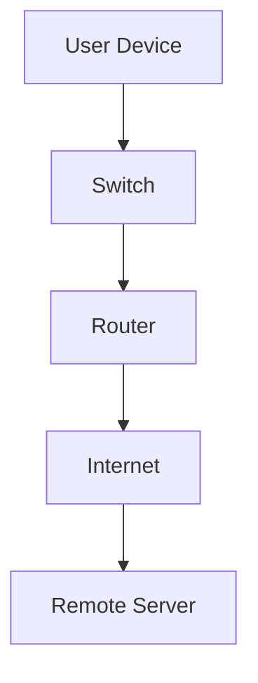
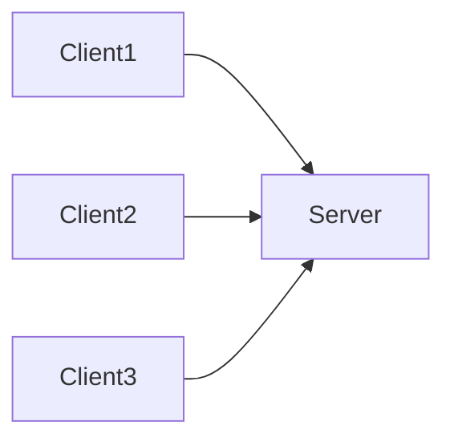
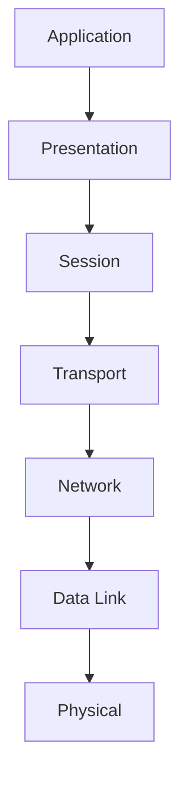
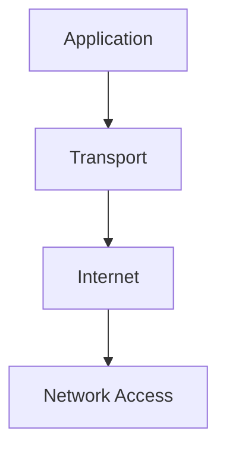
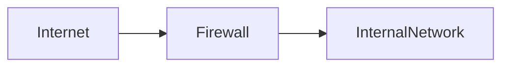
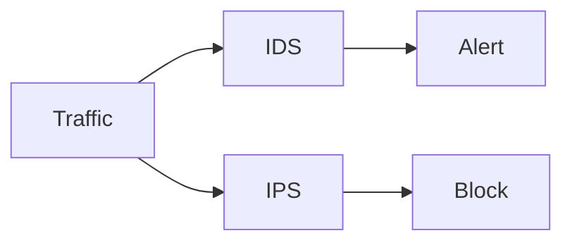
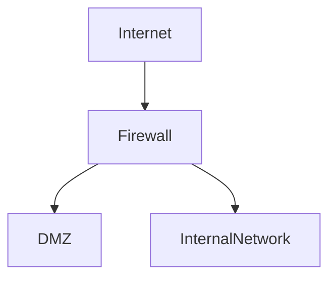
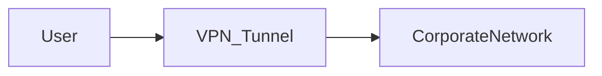
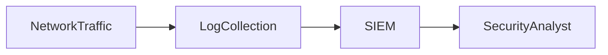

# 🏛️ DOMAIN 4 — Network Security

This domain focuses on **network architecture, communication protocols, and security technologies** used to protect data in transit.

---

# 🌐 Network Fundamentals

Computer networks allow systems to **communicate and exchange data**.

| Component | Description |
|---|---|
| Host | Device connected to the network |
| Switch | Connects devices within a LAN |
| Router | Routes traffic between networks |
| Firewall | Filters network traffic |
| IDS / IPS | Detects or blocks malicious activity |

---

# 📡 Network Types

| Network Type | Full Name | Description |
|---|---|---|
| LAN | Local Area Network | Small local network |
| WAN | Wide Area Network | Large geographic network |
| MAN | Metropolitan Area Network | City-scale network |
| PAN | Personal Area Network | Very small network (Bluetooth) |

---

# 🧱 Network Architecture

Networks may follow different design models.

| Architecture | Description |
|---|---|
| Client-Server | Central server provides services |
| Peer-to-Peer | Devices share resources directly |

---

# 🧠 OSI Model (Open Systems Interconnection)

The **OSI Model (Open Systems Interconnection Model)** describes how network communication occurs in **seven layers**.

| Layer | Description | Examples |
|---|---|---|
| Application | User-facing protocols | HTTP, FTP |
| Presentation | Data formatting & encryption | TLS |
| Session | Session management | NetBIOS |
| Transport | End-to-end communication | TCP, UDP |
| Network | Logical addressing | IP |
| Data Link | Frame transmission | Ethernet |
| Physical | Hardware transmission | Cables |

---

# 🌍 TCP/IP Model

The **TCP/IP (Transmission Control Protocol / Internet Protocol) Model** is the practical model used on the internet.

| TCP/IP Layer | Equivalent OSI Layers |
|---|---|
| Application | OSI 7–5 |
| Transport | OSI 4 |
| Internet | OSI 3 |
| Network Access | OSI 2–1 |

---

# 📦 Common Network Protocols

| Protocol | Full Name | Default Port | Purpose |
|---|---|---|---|
| HTTP | Hypertext Transfer Protocol | 80 | Web communication |
| HTTPS | Hypertext Transfer Protocol Secure | 443 | Secure web traffic |
| FTP | File Transfer Protocol | 21 | File transfer |
| SSH | Secure Shell | 22 | Secure remote login |
| DNS | Domain Name System | 53 | Name resolution |
| SMTP | Simple Mail Transfer Protocol | 25 | Email sending |
| POP3 | Post Office Protocol v3 | 110 | Email retrieval |
| IMAP | Internet Message Access Protocol | 143 | Email retrieval |

---

# 🔐 Secure Protocols

Secure protocols provide **confidentiality, integrity, and authentication**.

| Protocol | Full Name | Security Purpose |
|---|---|---|
| TLS | Transport Layer Security | Encrypts network communication |
| SSH | Secure Shell | Secure remote access |
| HTTPS | HTTP over TLS | Secure web browsing |
| SFTP | SSH File Transfer Protocol | Secure file transfer |

---

# 🔥 Firewalls

A **firewall** controls network traffic based on defined rules.

| Firewall Type | Description |
|---|---|
| Packet Filtering Firewall | Filters based on IP and port |
| Stateful Firewall | Tracks connection state |
| Application Firewall | Inspects application-level traffic |
| Next-Generation Firewall | Advanced inspection and threat intelligence |

---

# 🛡️ Intrusion Detection and Prevention

Security systems monitor networks for suspicious behavior.

| System | Full Name | Function |
|---|---|---|
| IDS | Intrusion Detection System | Detects malicious activity |
| IPS | Intrusion Prevention System | Detects and blocks threats |

---

# 🌐 Network Segmentation

Network segmentation improves security by **isolating network zones**.

| Zone | Description |
|---|---|
| Internet | External untrusted network |
| DMZ (Demilitarized Zone) | Public-facing services |
| Internal Network | Trusted internal systems |

---

# 🔒 Virtual Private Networks (VPN)

A **VPN (Virtual Private Network)** creates a **secure encrypted tunnel** over an untrusted network.

| VPN Type | Description |
|---|---|
| Remote Access VPN | Connects individual users |
| Site-to-Site VPN | Connects two networks |

Common VPN protocols:

| Protocol | Full Name |
|---|---|
| IPsec | Internet Protocol Security |
| L2TP | Layer 2 Tunneling Protocol |
| PPTP | Point-to-Point Tunneling Protocol |

---

# 📡 Wireless Security

Wireless networks introduce additional risks.

| Standard | Full Name | Security Level |
|---|---|---|
| WEP | Wired Equivalent Privacy | Weak (obsolete) |
| WPA | Wi-Fi Protected Access | Improved security |
| WPA2 | Wi-Fi Protected Access 2 | Strong encryption |
| WPA3 | Wi-Fi Protected Access 3 | Modern standard |

Common wireless threats:

| Attack | Description |
|---|---|
| Evil Twin | Rogue Wi-Fi access point |
| Deauthentication Attack | Disconnects devices |
| Packet Sniffing | Captures network traffic |

---

# 🛠️ Network Monitoring

Security teams continuously monitor networks.

| Tool | Full Name | Function |
|---|---|---|
| SIEM | Security Information and Event Management | Aggregates and analyzes logs |
| NetFlow | Network Flow Monitoring | Analyzes traffic patterns |
| Packet Capture | Traffic inspection | Investigates network activity |

---

# ⚠️ Exam Tips

Common exam traps:

| Topic | Trap |
|---|---|
| OSI vs TCP/IP | Know layer mapping |
| IDS vs IPS | Detect vs Block |
| HTTP vs HTTPS | Encryption difference |
| WEP vs WPA3 | Security strength |

---

# 🎯 Key Takeaway

Domain 4 focuses on **protecting data in transit and securing network infrastructure**.

Core goals:

- Secure communication protocols  
- Network monitoring and detection  
- Segmentation and access control  
- Protection against network-based attacks