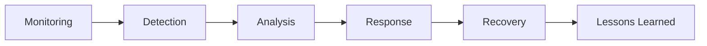
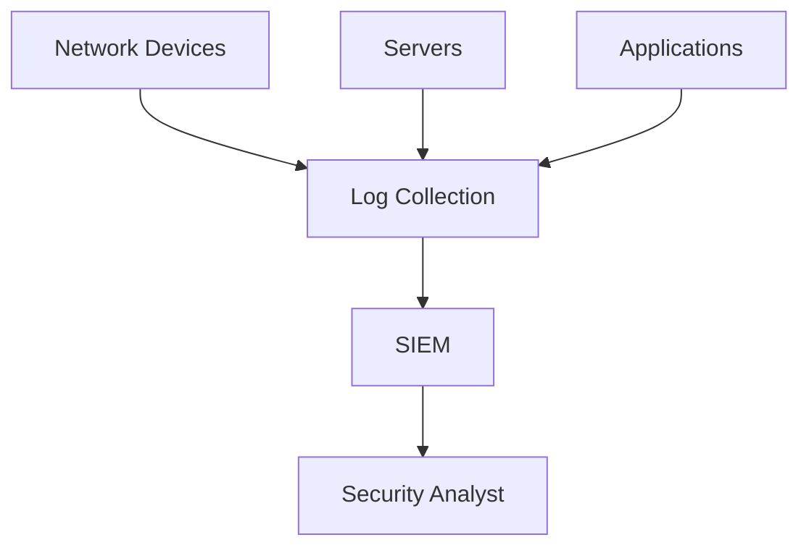
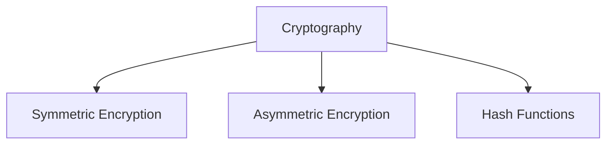
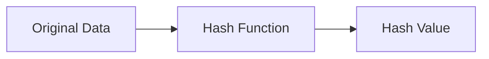
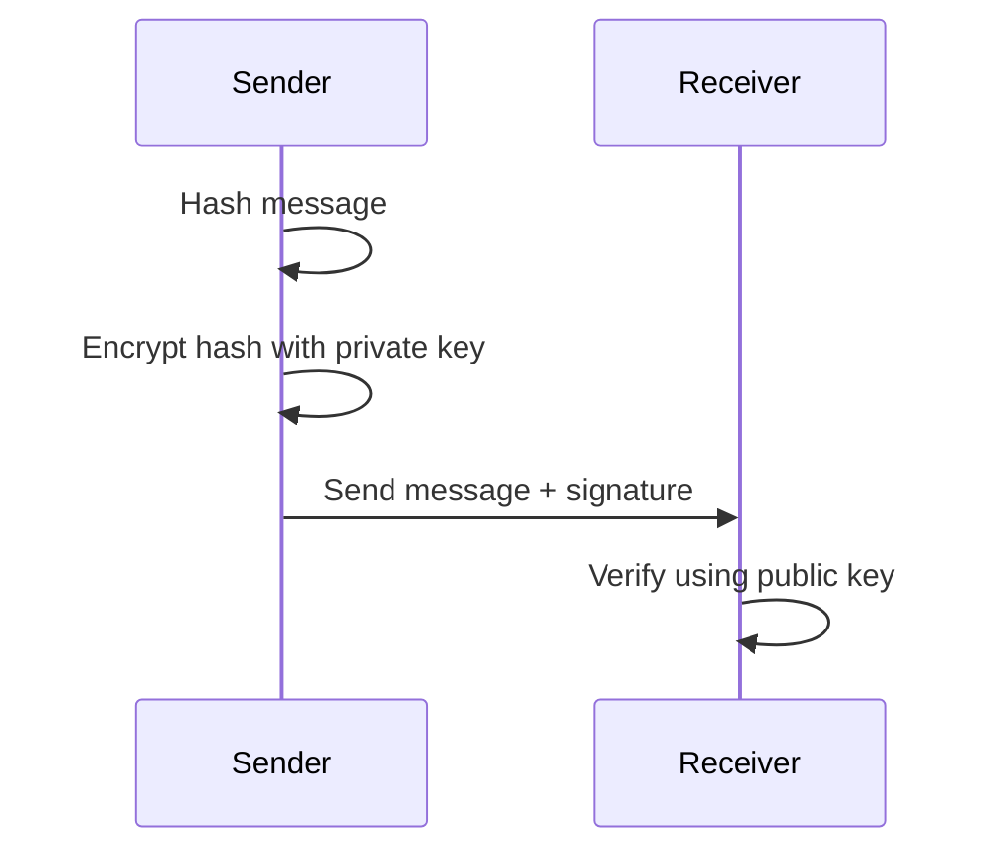
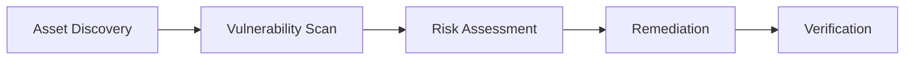
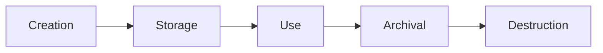

# 🏛️ DOMAIN 5 — Security Operations


This domain focuses on **day-to-day cybersecurity operations**, including monitoring, vulnerability management, cryptography basics, system hardening, and secure data handling.

Security Operations ensure that **security controls are continuously applied, monitored, and improved**.

---

# 🛡️ Security Operations Lifecycle



| Phase | Description |
|---|---|
| Monitoring | Continuous observation of systems |
| Detection | Identifying suspicious activity |
| Analysis | Determining the scope and impact |
| Response | Taking corrective action |
| Recovery | Restoring normal operations |
| Lessons Learned | Improving future defenses |

---

# 🔍 Security Monitoring

Security monitoring ensures **continuous visibility of systems and networks**.



| Tool | Full Name | Purpose |
|---|---|---|
| SIEM | Security Information and Event Management | Aggregates and analyzes security logs |
| EDR | Endpoint Detection and Response | Detects threats on endpoints |
| NDR | Network Detection and Response | Detects malicious network activity |
| SOAR | Security Orchestration Automation and Response | Automates security workflows |

---

# 🧠 Security Logs

Logs are essential for **monitoring, auditing, and investigations**.

| Log Type | Description |
|---|---|
| System Logs | Operating system events |
| Application Logs | Application-specific activity |
| Security Logs | Authentication and access events |
| Network Logs | Network traffic and connections |

Best practices:

- Centralized log storage  
- Time synchronization (NTP — Network Time Protocol)  
- Log integrity protection  
- Regular log review

---

# 🔐 Cryptography Basics

Cryptography protects **confidentiality, integrity, and authenticity**.



| Type | Description | Examples |
|---|---|---|
| Symmetric Encryption | Same key for encryption and decryption | AES |
| Asymmetric Encryption | Public and private key pair | RSA, ECC |
| Hashing | One-way function for data integrity | SHA-256 |

---

# 🔑 Encryption Algorithms

| Algorithm | Full Name | Type |
|---|---|---|
| AES | Advanced Encryption Standard | Symmetric |
| DES | Data Encryption Standard | Symmetric (obsolete) |
| 3DES | Triple Data Encryption Standard | Symmetric |
| RSA | Rivest–Shamir–Adleman | Asymmetric |
| ECC | Elliptic Curve Cryptography | Asymmetric |

⚠ **Exam Tip**

ECC is commonly used for **mobile and IoT devices** due to **strong security with smaller key sizes**.

---

# 🔎 Hash Functions

Hashing ensures **data integrity**.



| Algorithm | Status |
|---|---|
| MD5 | Broken |
| SHA-1 | Deprecated |
| SHA-256 | Secure |

Properties of hash functions:

- One-way function  
- Deterministic output  
- Fixed output size  
- Avalanche effect

---

# 🔐 Digital Signatures

Digital signatures provide:

- Authentication  
- Integrity  
- Non-repudiation



---

# ⚙️ System Hardening

System hardening reduces the **attack surface**.

| Technique | Description |
|---|---|
| Patch Management | Apply security updates |
| Disable Unnecessary Services | Reduce attack vectors |
| Remove Default Accounts | Prevent unauthorized access |
| Secure Configuration | Follow security baselines |

---

# 📏 Baseline vs Hardening

| Concept | Description |
|---|---|
| Baseline Configuration | Documented standard system configuration |
| System Hardening | Applying security configurations to reduce risk |

Examples of hardening:

- Close unused ports  
- Enforce strong authentication  
- Apply security patches  
- Disable legacy protocols

---

# 🛠️ Vulnerability Management

Vulnerability management identifies and fixes weaknesses.



| Step | Description |
|---|---|
| Discovery | Identify systems and assets |
| Scanning | Detect vulnerabilities |
| Assessment | Evaluate severity |
| Remediation | Patch or mitigate |
| Verification | Confirm fix effectiveness |

---

# 🧹 Data Lifecycle Security

Data must be protected **throughout its lifecycle**.



| Stage | Description |
|---|---|
| Creation | Data is generated |
| Storage | Data stored securely |
| Use | Data accessed by users |
| Archival | Long-term retention |
| Destruction | Secure disposal |

---

# 🔥 Secure Data Destruction

Sensitive data must be permanently destroyed.

| Method | Description |
|---|---|
| Clearing | Logical overwrite |
| Purging | Advanced sanitization |
| Degaussing | Magnetic field destruction |
| Physical Destruction | Shredding or crushing |

⚠ **Exam Tip**

```
Physical Destruction = Most secure method
```

---

# 🧠 Principle of Least Privilege (PoLP)

PoLP — **Principle of Least Privilege** ensures users only receive **minimum required permissions**.

Benefits:

- Reduces insider threats  
- Limits attack surface  
- Prevents privilege escalation

---

# ⚠️ Common Operational Risks

| Risk | Description |
|---|---|
| Misconfiguration | Incorrect system settings |
| Unpatched systems | Vulnerable software |
| Weak authentication | Poor password policies |
| Insider threats | Malicious or careless employees |

---

# 🎯 Key Takeaway

Domain 5 focuses on **operational security practices** used to maintain and protect systems.

Core responsibilities include:

- Continuous monitoring  
- Vulnerability management  
- Cryptographic protection  
- System hardening  
- Secure data lifecycle management