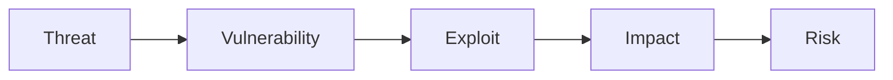
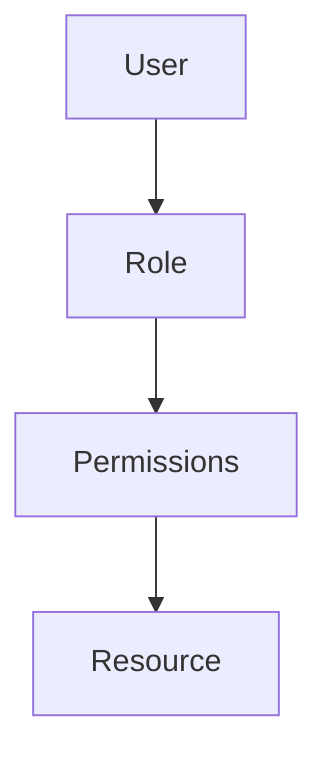
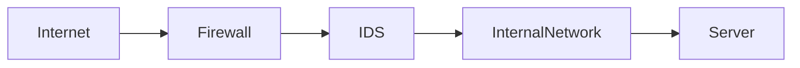
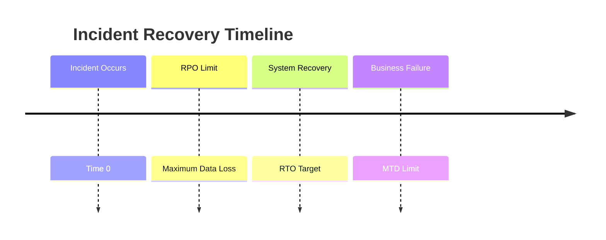
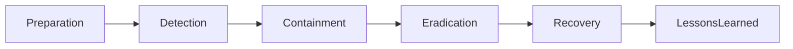
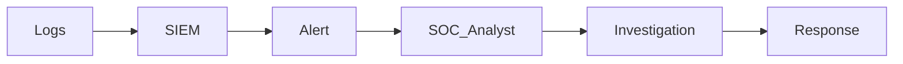
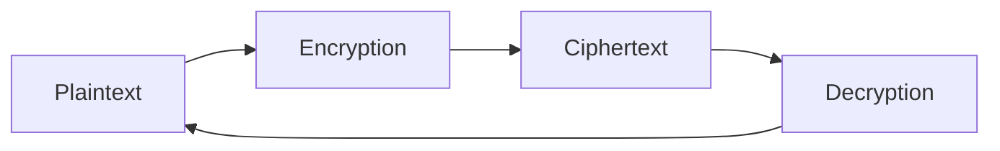
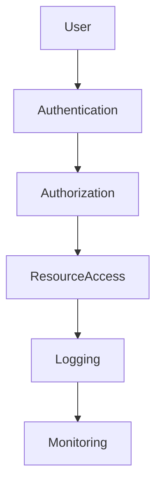
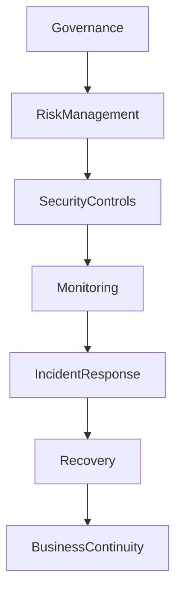

# ⚡ CC (ISC2) — Quick Review Sheet
### Certified in Cybersecurity — Last Minute Revision Guide

---

# 🧠 Core Security Principles

| Principle | Description |
|------|------|
| Confidentiality | Prevents unauthorized disclosure of information |
| Integrity | Ensures information is accurate and unmodified |
| Availability | Ensures systems and data are accessible when needed |

---

# 🔐 Security Governance Snapshot

| Concept | Key Idea |
|------|------|
| Governance | Strategic direction and oversight of security |
| Risk Management | Identifying and managing threats to the organization |
| Compliance | Following laws, regulations, and policies |
| Security Policy | High-level rules defining security expectations |

---

# ⚠️ Risk Management Summary

| Component | Meaning |
|------|------|
| Threat | Something capable of causing harm |
| Vulnerability | Weakness that can be exploited |
| Risk | Likelihood and impact of a threat exploiting a vulnerability |
| Control | Safeguard used to reduce risk |

---

## Risk Flow

---

# 🛡️ Security Controls

| Control Type | Purpose |
|------|------|
| Preventive Controls | Stop incidents from occurring |
| Detective Controls | Identify incidents when they happen |
| Corrective Controls | Restore systems after incidents |
| Deterrent Controls | Discourage potential attackers |
| Compensating Controls | Alternative safeguards when primary control cannot be used |

---

# 🏢 Access Control Models

| Model | Description |
|------|------|
| DAC — Discretionary Access Control | Resource owner decides access |
| MAC — Mandatory Access Control | Access based on classification levels |
| RBAC — Role Based Access Control | Access based on job role |
| ABAC — Attribute Based Access Control | Access based on attributes and policies |

---

---

# 🔑 Authentication Factors

| Factor Type | Example |
|------|------|
| Something You Know | Password, PIN |
| Something You Have | Smart card, token |
| Something You Are | Biometrics |
| Somewhere You Are | Location-based access |

---

# 🌐 Network Security Quick View

| Security Mechanism | Function |
|------|------|
| Firewall | Filters network traffic |
| IDS — Intrusion Detection System | Detects suspicious activity |
| IPS — Intrusion Prevention System | Detects and blocks attacks |
| VPN — Virtual Private Network | Secure encrypted communication |

---

---

# 🧾 Business Continuity Essentials

| Concept | Full Meaning |
|------|------|
| BIA — Business Impact Analysis | Identifies critical business functions and impact of disruption |
| RTO — Recovery Time Objective | Maximum acceptable downtime |
| RPO — Recovery Point Objective | Maximum acceptable data loss |
| MTD — Maximum Tolerable Downtime | Absolute limit before business failure |

---

---

# 🚨 Incident Response Process

Based on **NIST Incident Response Lifecycle**

| Phase | Description |
|------|------|
| Preparation | Establish policies, tools, and training |
| Detection & Analysis | Identify and investigate incidents |
| Containment | Limit damage and isolate threat |
| Eradication | Remove root cause |
| Recovery | Restore systems |
| Lessons Learned | Improve future response |

---

---

# 🖥️ SOC Operations

| SOC Function | Description |
|------|------|
| Monitoring | Continuous log and event monitoring |
| Alert Triage | Investigating security alerts |
| Threat Detection | Identifying malicious activity |
| Incident Escalation | Passing incidents to response teams |

---

---

# 🔐 Encryption Basics

| Term | Meaning |
|------|------|
| Encryption | Converting plaintext to ciphertext |
| Decryption | Converting ciphertext back to plaintext |
| Symmetric Encryption | Same key used for encryption and decryption |
| Asymmetric Encryption | Uses public and private key pair |

---

---

# 🧩 Malware Types

| Malware | Description |
|------|------|
| Virus | Attaches itself to files |
| Worm | Self-replicating malware spreading across networks |
| Trojan | Malicious software disguised as legitimate |
| Ransomware | Encrypts files and demands payment |

---

# 📊 Security Best Practices

| Practice | Purpose |
|------|------|
| Least Privilege | Users receive only necessary permissions |
| Defense in Depth | Multiple layers of security |
| Patch Management | Fix vulnerabilities regularly |
| Security Awareness | Training users to prevent attacks |

---

---

# ⚡ Final Exam Memory Tips

| Topic | What To Remember |
|------|------|
| CIA Triad | Confidentiality, Integrity, Availability |
| Risk | Threat × Vulnerability × Impact |
| Access Control | DAC, MAC, RBAC, ABAC |
| BCP vs DRP | Business Continuity keeps business running / Disaster Recovery restores IT |
| Incident Response | Preparation → Detection → Containment → Eradication → Recovery |

---

# 🧠 Mental Model for the CC Exam

---

# 🎯 Exam Focus Areas

| Domain | Priority |
|------|------|
| Security Principles | High |
| Access Controls | High |
| Network Security | High |
| Risk Management | High |
| Incident Response | Medium |
| Business Continuity | Medium |

---

# 🧾 One Sentence Summary

> **Cybersecurity is about managing risk through layered controls, monitoring systems, responding to incidents, and ensuring the business continues operating even during disruption.**